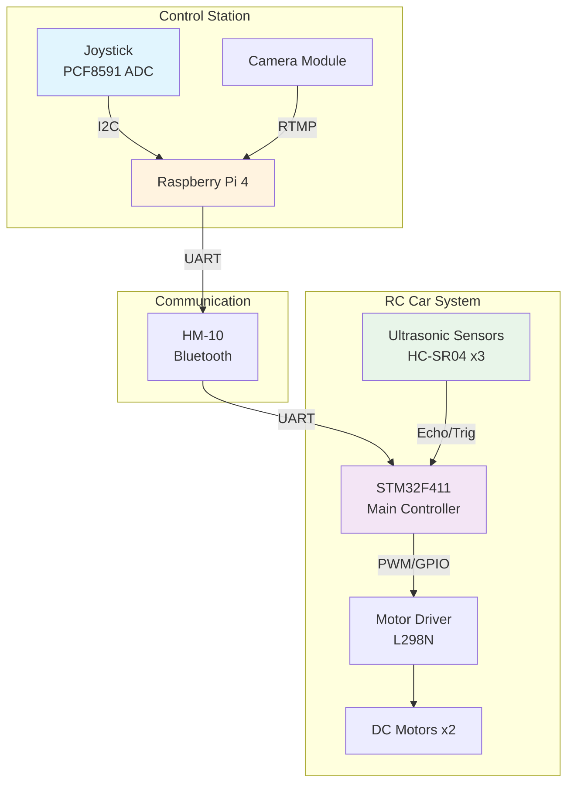

# 🚗 Autonomous RC Car Project
> **STM32F411 & Raspberry Pi 4 기반 실시간 자율주행 시스템**

<div align="center">


</div>

---

## 📌 Overview

초음파 센서와 FreeRTOS를 활용한 **실시간 장애물 회피 자율주행 RC카 시스템**입니다.  
STM32F411과 Raspberry Pi 4의 이중 제어 구조로 안정적이고 효율적인 자율주행을 구현했습니다.

### ✨ Key Features

<div align="center">
<table>
<tr>
<td width="50%">

#### 🎯 **자율주행 모드**
- 3방향 초음파 센서 기반 장애물 감지
- 실시간 경로 판단 알고리즘
- 벽 추종 주행 기능
- 동적 속도 조절

</td>
<td width="50%">

#### 🕹️ **수동 제어 모드**
- 무선 조이스틱 제어
- 비례 속도 제어 (PWM)
- 부드러운 가감속
- 제자리 회전 지원

</td>
</tr>
</table>
</div>

### 🎯 Project Goals

<div align="center">

| 목표 | 설명 | 달성도 |
|:---:|:---|:---:|
| **실시간 장애물 회피** | 90ms 주기 센서 스캔으로 즉각적인 반응 | ✅ **완료** |
| **모드 전환** | 수동/자율 모드 실시간 전환 | ✅ **완료** |
| **무선 제어** | Bluetooth 기반 원격 제어 | ✅ **완료** |
| **영상 스트리밍** | RTMP 실시간 영상 전송 | ✅ **완료** |

</div>

---

## 🏗️ System Architecture

### 전체 시스템 구조도



### 📁 Project Structure

```
autonomous-car-project/
│
├── 📂 stm32_411/                 # STM32F411 펌웨어
│   ├── 📄 Core/
│   │   ├── main.c/h              # 메인 프로그램 진입점
│   │   ├── main.h                # 전역 정의 및 모드 설정
│   │   └── stm32f4xx_it.c/h      # 인터럽트 핸들러
│   │
│   ├── 📦 Drivers/
│   │   ├── motorset.c/h          # 모터 제어 (PWM, 방향)
│   │   ├── ultrasonic.c/h        # 초음파 센서 인터페이스
│   │   ├── delay.c/h              # 마이크로초 단위 딜레이
│   │   └── raspi.c/h              # Raspberry Pi 통신
│   │
│   ├── 🔧 HAL/
│   │   ├── tim.c/h                # 타이머 설정 (PWM, Input Capture)
│   │   ├── usart.c/h              # UART 통신 (Bluetooth, Debug)
│   │   └── gpio.c/h               # GPIO 초기화
│   │
│   ├── 🧠 FreeRTOS/
│   │   ├── freertos.c             # RTOS 태스크 정의
│   │   └── FreeRTOSConfig.h       # RTOS 설정
│   │
│   └── 📋 Project Files/
│       └── .ioc                    # STM32CubeMX 설정 파일
│
├── 📂 raspi/                      # Raspberry Pi 제어 코드
│   └── 🎮 car.py                 # 메인 제어 프로그램
│
│
│
├── 📄 README.md                   # 프로젝트 소개
└── 🚫 .gitignore                 # Git 제외 파일
```

---

## 🚀 Quick Start

### Prerequisites

#### 🔧 Hardware Requirements
<div align="center">

| Component | Model | Quantity | Purpose |
|:---:|:---:|:---:|:---|
| **MCU** | STM32F411 Discovery | 1 | 메인 컨트롤러 |
| **SBC** | Raspberry Pi 4 | 1 | 원격 제어 & 영상 |
| **센서** | HC-SR04 | 3 | 전방/좌/우 거리 측정 |
| **통신** | HM-10 (BLE) | 2 | 무선 통신 |
| **모터** | DC 기어드 모터 | 2 | 구동 |
| **드라이버** | L298N | 1 | 모터 제어 |
| **ADC** | PCF8591 | 1 | 조이스틱 입력 |
| **전원** | 7.4V Li-Po | 1 | 차체 전원 |

</div>

#### 💻 Software Requirements
- **STM32CubeIDE** 1.13.0+
- **Python** 3.8+
- **Git**
- **[추가 필요]** ST-Link 드라이버

### Installation

#### 1️⃣ **저장소 복제**
```bash
git clone https://github.com/[your-username]/autonomous-car-stm32-rpi.git
cd autonomous-car-stm32-rpi
```

#### 2️⃣ **STM32 펌웨어 설정**

<details>
<summary><b>📝 STM32CubeIDE 설정 방법</b></summary>

1. STM32CubeIDE 실행
2. File → Import → Existing Projects into Workspace
3. `stm32_411` 폴더 선택
4. Project → Build All (또는 Ctrl+B)
5. Run → Debug As → STM32 C/C++ Application

**⚠️ 주의사항:**
- ST-Link 드라이버 설치 확인
- 보드 전원 연결 확인
- Debug 설정에서 올바른 타겟 선택

</details>

#### 3️⃣ **Raspberry Pi 설정**

<details>
<summary><b>🍓 Raspberry Pi 초기 설정</b></summary>

```bash
# 시스템 업데이트
sudo apt-get update
sudo apt-get upgrade -y

# 필요 패키지 설치
sudo apt-get install -y python3-pip python3-venv git
sudo apt-get install -y bluetooth bluez libbluetooth-dev
sudo apt-get install -y i2c-tools python3-smbus

# I2C 활성화
sudo raspi-config
# Interface Options → I2C → Enable

# Bluetooth 권한 설정
sudo usermod -a -G bluetooth $USER
sudo systemctl restart bluetooth

# Python 가상환경 생성
python3 -m venv venv
source venv/bin/activate

# 패키지 설치
pip install -r requirements.txt
```

</details>

#### 4️⃣ **Python 패키지 설치**
```bash
# Raspberry Pi에서
cd raspi
pip install asyncio bleak smbus2 opencv-python RPi.GPIO

# [추가 필요] RTMP 스트리밍용
pip install ffmpeg-python
```

---

## 💻 Usage

### 🎮 시스템 시작 순서

#### Step 1: STM32 보드 준비
```bash
1. 차체 전원 ON (7.4V)
2. STM32 보드 전원 확인 (LED)
3. 펌웨어 업로드 (STM32CubeIDE)
4. 시리얼 모니터로 상태 확인
```

#### Step 2: Raspberry Pi 실행
```bash
# SSH 또는 직접 접속
ssh pi@[라즈베리파이_IP]

# 프로그램 실행
cd ~/autonomous-car-project/raspi
python3 car.py
```

### 🚗 주요 기능 사용법

#### 자율주행 모드
1. 조이스틱 **SW 버튼** 클릭
2. LED 표시: 🟢 녹색
3. 차량이 자동으로 장애물 회피 시작
4. 실시간 센서 값 모니터링 가능

#### 수동 제어 모드
1. 조이스틱 **SW 버튼** 재클릭
2. LED 표시: 🔵 파란색
3. 조이스틱으로 방향 제어
   - 전진/후진: Y축
   - 좌/우 회전: X축

### 📊 FreeRTOS 태스크 구조

<div align="center">

| Task Name | Priority | Period | Stack | Function |
|:---:|:---:|:---:|:---:|:---|
| `JoystickRecv` | Low | 20ms | 512B | BT 데이터 수신 & 모드 전환 |
| `ManualDrv` | Low | 20ms | 512B | 수동 모드 모터 제어 |
| `AutoDrv_Sensor` | AboveNormal | 30ms×3 | 512B | 초음파 센서 측정 |
| `AutoDrv_Control` | AboveNormal | 100ms | 512B | 자율주행 알고리즘 |

</div>

### 🔍 통신 프로토콜

#### Bluetooth 데이터 형식
```c
// 조이스틱 데이터
"Y값,X값\n"  // 예: "2048,1950\n"

// 모드 전환 명령
'1'  // MODE_MANUAL (수동)
'2'  // MODE_AUTO (자율)

// [추가 필요] 상태 응답
"STATUS:mode,speed,distance_f,distance_l,distance_r\n"
```

---

## 🎥 Demo

### 시연 영상

<div align="center">

[](https://youtu.be/y5vkQzpRwDc)

</div>

### 주요 시나리오

#### 🚧 시나리오 1: 장애물 회피
```
1. 전방 20cm 장애물 감지
2. 좌/우 거리 비교
3. 넓은 쪽으로 회피
4. 정상 주행 복귀
```

#### 🏃 시나리오 2: 벽 추종
```
1. 한쪽 벽 감지 (30cm 이내)
2. 일정 거리 유지하며 주행
3. 코너 감지 시 회전
4. 계속 추종
```

### 성능 지표

<div align="center">

| Metric | Target | Achieved | Note |
|:---:|:---:|:---:|:---|
| **센서 응답시간** | <100ms | 90ms | ✅ 달성 |
| **최대 속도** | 1m/s | 0.8m/s | 🔄 조정 중 |
| **장애물 감지 거리** | 80cm | 80cm | ✅ 달성 |

</div>

---

## 🔧 Configuration

### 주요 설정 파라미터

<details>
<summary><b>⚙️ motorset.h - 모터 제어 설정</b></summary>

```c
// PWM 설정
#define PWM_MAX      1000  // 최대 듀티 (100%)
#define PWM_MIN      650   // 최소 듀티 (65%)
#define PWM_STEERING_MAX 1200  // 조향 최대 차이

// 자율주행 거리
#define DIST_MAX 80     // 최대 감지거리 (cm)
#define DIST_MIN 20     // 최소 안전거리 (cm)
#define DIST_SAFE 35    // 권장 안전거리 (cm)

// 조이스틱 데드존
#define DEADZONE_Y   100   // Y축 데드존
#define DEADZONE_X   100   // X축 데드존
```

</details>

<details>
<summary><b>⏱️ FreeRTOSConfig.h - RTOS 설정</b></summary>

```c
#define configTICK_RATE_HZ       1000  // 1ms tick
#define configMAX_PRIORITIES     56
#define configMINIMAL_STACK_SIZE 128
#define configTOTAL_HEAP_SIZE    15360
```

</details>

---

## 🐛 Troubleshooting

### 자주 발생하는 문제와 해결방법

<details>
<summary><b>❌ Bluetooth 연결 실패</b></summary>

**증상:** HM-10 페어링 안됨
```bash
# 해결방법
1. HM-10 전원 확인 (3.3V)
2. Baud rate 확인 (9600)
3. AT 명령으로 초기화
   AT+RENEW
   AT+RESET
4. 페어링 재시도
```

</details>

<details>
<summary><b>❌ 초음파 센서 오작동</b></summary>

**증상:** 거리값 0 또는 비정상
```c
// 체크리스트
1. 전원 확인 (5V)
2. Trig/Echo 핀 연결 확인
3. 타이머 설정 확인 (htim4)
4. 센서 간 간섭 체크 (30ms 간격)
```

</details>

<details>
<summary><b>❌ 모터 동작 안함</b></summary>

**증상:** PWM 신호는 있으나 모터 정지
```c
// 해결방법
1. L298N 전원 확인 (7.4V + 5V)
2. Enable 핀 점퍼 확인
3. PWM 주파수 확인 (109kHz)
4. 모터 배선 확인
```

</details>

---

## 📈 Performance & Optimization

### 최적화 항목

- [x] 센서 측정 주기 단축 (180ms → 90ms)
- [x] PWM 곡선 스케일링 적용
- [x] 모드 전환 디바운싱 추가

---

## 🚧 Future Work

### 계획된 개선사항

- [ ] **AI 비전 추가** - OpenCV 기반 차선 인식
- [ ] **GPS 모듈 연동** - 실외 주행 경로 추적
- [ ] **멀티 센서 퓨전** - IMU, 엔코더 추가

---


---


### 🤝 Contributing

프로젝트 기여를 환영합니다! [CONTRIBUTING.md](CONTRIBUTING.md) 를 참고해주세요.

문의사항: [GitHub Issues](https://github.com/HyunBeen96/car_project/issues)

---

---

## 📚 References

- [STM32F411 Reference Manual](https://www.st.com/resource/en/reference_manual/rm0383-stm32f411xce-advanced-armbased-32bit-mcus-stmicroelectronics.pdf)
- [FreeRTOS Documentation](https://www.freertos.org/Documentation/RTOS_book.html)
- [HC-SR04 Datasheet](https://cdn.sparkfun.com/datasheets/Sensors/Proximity/HCSR04.pdf)

---

<div align="center">

**⭐ 이 프로젝트가 도움이 되었다면 Star를 눌러주세요!**


<br>

*Last Updated: January 2025*

</div>
